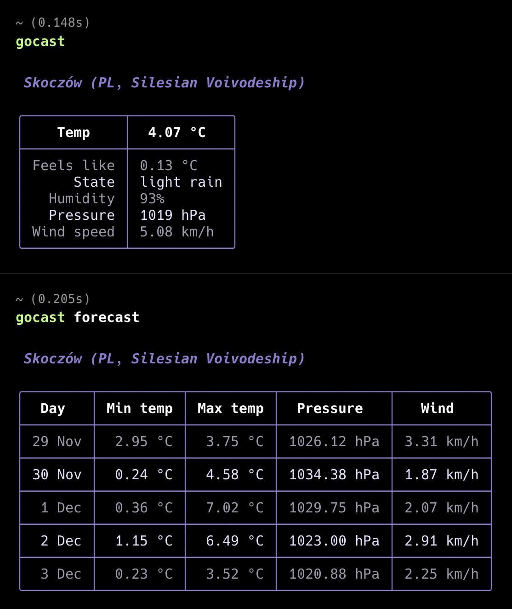

# GoCast
### GoCast is a simple CLI app for displaying current weather

## Getting started
1. Make sure you have [go](https://go.dev/doc/install) installed on your host
1. Run `go mod download` to install dependencies
1. Get your [OpenWeather API Key](https://home.openweathermap.org/api_keys) and use it in `init/env.go` file based on `init/env.go.example`
1. Run app with `go run cmd/main.go`